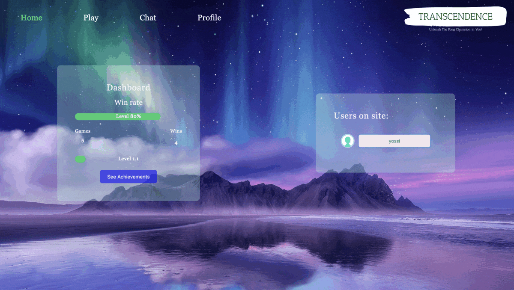

# Transcendence

This is a fullstack project, it is about creating a website for the mighty Pong contest !

This is the last project of the common core of 42 school. It took 5 developers and a few months to complete, but it was well worth it 🥹 

## Features

The website is a single-page application, so we learned a lot about **AJAX** and **WebSockets**

### 💬 Live chat
---
You can chat instantly with other users ! Chat in groups or private messages with your friends.

### 🏓 Online multiplayer pong game
---
You can play the original 1972 pong game with your friends or random users thanks to a matchmaking system.

### 👥 Channels
---
You can create public channels, password protected channels or private channels. Channels have administrators that can block, kick or mute users !

### 🔒 User authentication 
---
Users can authenticate through the 42 Oauth system. You can also add **two-factor authentication** if you want !

---

## Tech Stack

**Frontend:**  Angular

**Backend:**  NestJS, PostgreSQL
